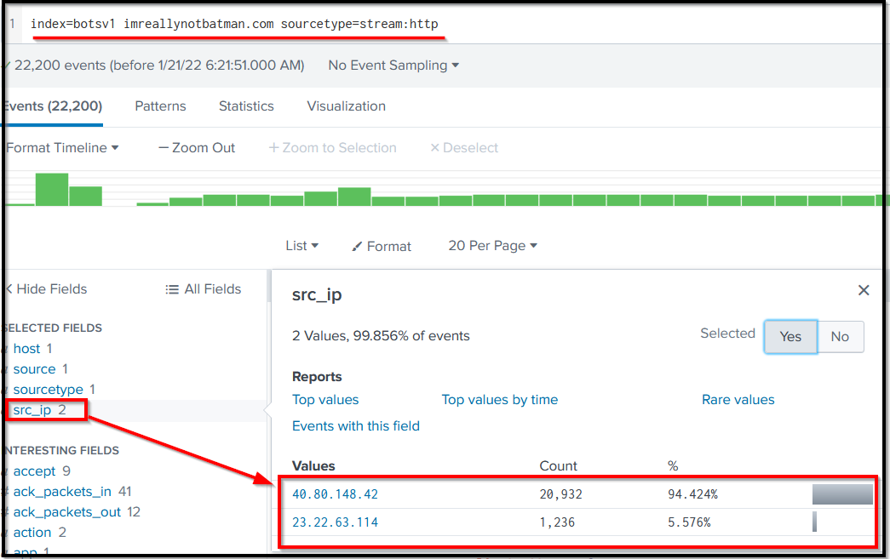
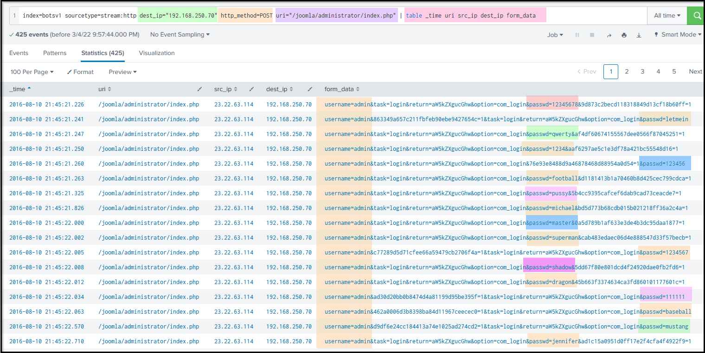
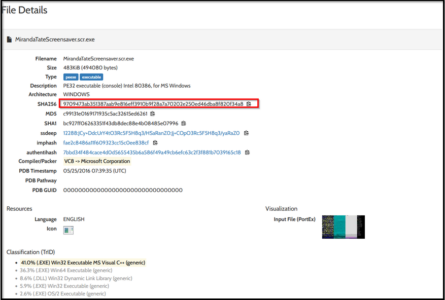

# Incident Handling with Splunk – TryHackMe Splunk 201 Lab

Type: Lab Project — TryHackMe SOC Level 1  
Skills: Splunk Querying, Cyber Kill Chain Mapping, Incident Timeline, Search Processing Language (SPL)

---

## Overview

This lab simulates incident analysis using Splunk SIEM. The task is to investigate a cyber attack on the fictional “Wayne Enterprise” site (`imreallynotbatman.com`), using various Splunk queries to map the attacker’s activity across Cyber Kill Chain stages and extract key artifacts. :contentReference[oaicite:3]{index=3}

Objectives:
- Investigate reconnaissance activity and extract CVE values  
- Identify brute-force attempts and credentials used  
- Find malware hashes, defacement filenames, and attacker domains  
- Map events onto Cyber Kill Chain phases

---

## What I Did

### 1) Reconnaissance & Discovery
- Queried Splunk for traffic related to the domain `imreallynotbatman.com`  
- Found reconnaissance indicators from Suricata and web logs (e.g. IP addresses targeting the server)  
- Extracted the CVE related to the request from Suricata alerts :contentReference[oaicite:4]{index=4}

### 2) Brute-Force & Exploitation
- Pinpointed `/joomla/administrator/index.php` as the URI with multiple brute-force attempts  
- Identified “admin” as the targeted username  
- Discovered “batman” as the correct password

### 3) Installation & Action on Objective
- Located `3791.exe` process details via Sysmon logs—captured MD5 and user context  
- Retrieved the defacement filename used on the compromised site

### 4) Weaponization & Infrastructure Mapping
- Identified attacker domains (`jumpingcrab.com` FQDN) and IPs tied to the intrusion  
- Used OSINT to associate domains with IPs and threat group emails :contentReference[oaicite:5]{index=5}

### 5) Delivery & Malware Indicators
- Retrieved malware hash used in delivery (`c99131e0169171935c5ac32615ed6261`)  
- Traced associated malware name from logs or threat intel

---

## Screenshots

- **Reconnaissance Splunk Search**  
  

- **Brute-Force Events Table**  
  

- **Malware Hash Lookup Result**  
  

---

## References

- TryHackMe – Splunk 201: Incident Handling with Splunk :contentReference[oaicite:6]{index=6}  
- [Splunk Documentation – SPL Basics](https://docs.splunk.com/Documentation/Splunk/latest/SearchTutorial/Welcometothismanual)
